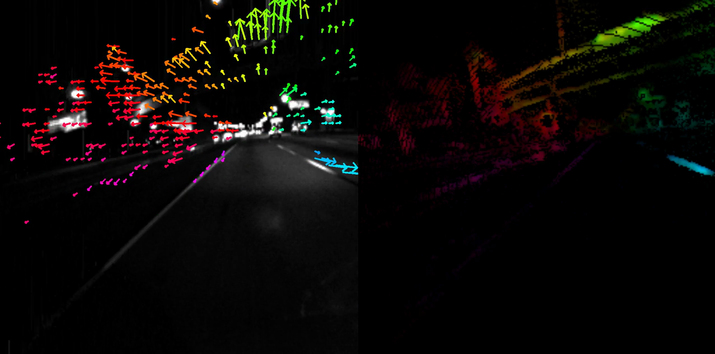

# EVFlowNet-pytorch

Author:CyrilSterling
EVFlowNet in pytorch.
The following is the README file in origin project.

  
Left: subsampled flow overlaid on top of grayscale image. Right: predicted flow at each pixel with an event.

This repo contains the code associated with [EV-FlowNet: Self-Supervised Optical Flow Estimation for Event-based Cameras](https://arxiv.org/abs/1802.06898). This code has most recently been tested with TensorFlow 1.10.0, but should work with anything down to 1.4.0. This code will only work with python 2. Python 3 is not supported.

## Introduction
In this work, we present a method to train a deep neural network to learn to predict optical flow from only events from an event-based camera, without any ground truth optical flow labels. Instead, supervision is provided to the network through the grayscale images also generated by an event-based camera such as the [DAVIS camera](https://ieeexplore.ieee.org/abstract/document/6889103/). 

## Citations
If you use this work in an academic publication, please cite the following work:  
[Alex Zihao Zhu, Liangzhe Yuan, Kenneth Chaney, Kostas Daniilidis. "EV-FlowNet: Self-Supervised Optical Flow Estimation for Event-based Cameras", Proceedings of Robotics: Science and Systems, 2018. DOI: 10.15607/RSS.2018.XIV.062.](http://www.roboticsproceedings.org/rss14/p62.html)

```
@INPROCEEDINGS{Zhu-RSS-18, 
    AUTHOR    = {Alex Zhu AND Liangzhe Yuan AND Kenneth Chaney AND Kostas Daniilidis}, 
    TITLE     = {EV-FlowNet: Self-Supervised Optical Flow Estimation for Event-based Cameras}, 
    BOOKTITLE = {Proceedings of Robotics: Science and Systems}, 
    YEAR      = {2018}, 
    ADDRESS   = {Pittsburgh, Pennsylvania}, 
    MONTH     = {June}, 
    DOI       = {10.15607/RSS.2018.XIV.062} 
} 
```

An updated arXiv version is also available:  
[Zhu, Alex Zihao, et al. "EV-FlowNet: Self-Supervised Optical Flow Estimation for Event-based Cameras." arXiv preprint arXiv:1802.06898 (2018).](https://arxiv.org/abs/1802.06898)

## Data
For convenience, the converted data for the ```outdoor_day``` and ```indoor_flying``` sequences can be found [__**here**__](https://drive.google.com/drive/folders/1sW5PPL8tyOPKafMKQkoRdsjL_cq6MJin?usp=sharing). Note that the ```outdoor_day1``` sequence has been shortened to the test sequence as described in the paper. The data can also be generated by running [extract_all_bags.sh](data/extract_all_bags.sh). Note that the converted data takes up **167GB** of space for all of the indoor_flying and outdoor_day sequences.

Ground truth flow computed from the paper can also be downloaded [__**here**__](https://drive.google.com/drive/folders/1XS0AQTuCwUaWOmtjyJWRHkbXjj_igJLp?usp=sharing). The ground truth takes up **31.7GB** for all of the indoor_flying and outdoor_day sequences.

The data used to train and test our models is from the [Multi Vehicle Stereo Event Camera dataset](https://daniilidis-group.github.io/mvsec/). For efficient batched reading, we convert the data from the [ROS bag](http://wiki.ros.org/rosbag) format to ```png``` for the grayscale images and ```TFRecords``` for the events, using [extract_rosbag_to_tf.py](data/extract_rosbag_to_tf.py). 

The default option is for the data to be downloaded into [mvsec_data](mvsec_data).

### Pre-trained Model
A pre-trained model can be downloaded [__**here**__](https://drive.google.com/drive/folders/1tHu1_ajMi1xdZdyDvDe6z6gOyX5PXDeQ?usp=sharing). The default option is for the model folder (ev-flownet) to be placed in [data/log/saver](data/log/saver).

## Updates to the architecture
This code has undergone a few improvements since publication in RSS. Most notably, they are:
* Random 2D rotations are applied as data augmentation at training time.
* Batch norm is used at training.
* The original model had 2 output channels before the predict_flow layer, which caused it to be quite sensitive and difficult to train. We have now increased this to 32 output channels to resolve these issues.

These improvements have greatly improved the robustness of the models, and they should now work reasonably in most environments. This decreases the AEE error for the dt=1 frames, but slightly increases them for the dt=4 frames. We will update the numbers in our arxiv submission with the new numbers shortly.

## Testing
The model can be tested using [test.py](src/test.py). The basic syntax is:  
```python test.py --training_instance ev-flownet --test_sequence outdoor_day1```  
This will evaluate the model on the ```outdoor_day1``` sequence.

The ```--test_plot``` argument plots the predicted flow, while ```--gt_path``` allows you to specify the path to the groundtruth flow npy file for evaluation. ```--test_skip_frames``` allows for testing with inputs 4 frames apart, as described in the paper. 

```--save_test_output``` will cause the predicted flows and event histograms, as well as optionally the GT flows to be saved to a npz file {$SEQUENCE}\_output.npz or {$SEQUENCE}\_output_gt.npz if GT is available. The saved data can be accessed from the npz file under the keys 'output_flows', 'event_images' and 'gt_flows'.

Useful evaluation functions can be found in [eval_utils.py](src/eval_utils.py). In particular, we provide a function that interpolates optical flow over multiple ground truth frames (for the 4 frames apart scenario).

## Training
To train a new model from scratch, the basic syntax is:  
```python train.py --training_instance model_name```  

More parameters are described by running:  
```python train.py -h```  
To modify the training data (it is only ```outdoor_day2``` by default), you can modify [train_bags.txt](data/train_bags.txt), with a separate sequence per line.

## Authors
[Alex Zihao Zhu](https://fling.seas.upenn.edu/~alexzhu/dynamic/), [Liangzhe Yuan](https://yuanliangzhe.github.io/), Kenneth Chaney and [Kostas Daniilidis](https://www.cis.upenn.edu/~kostas/).
